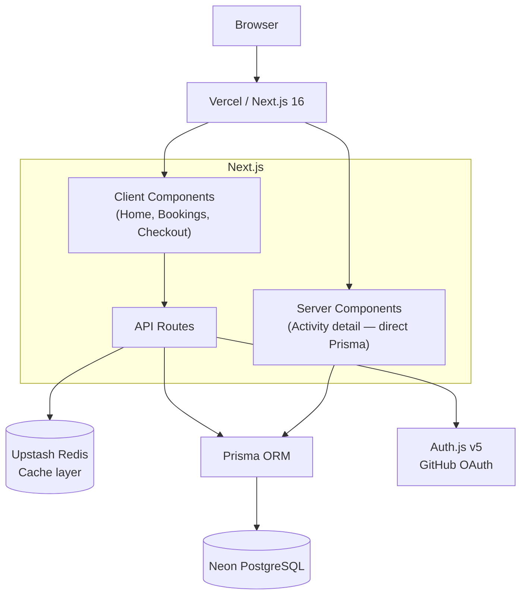
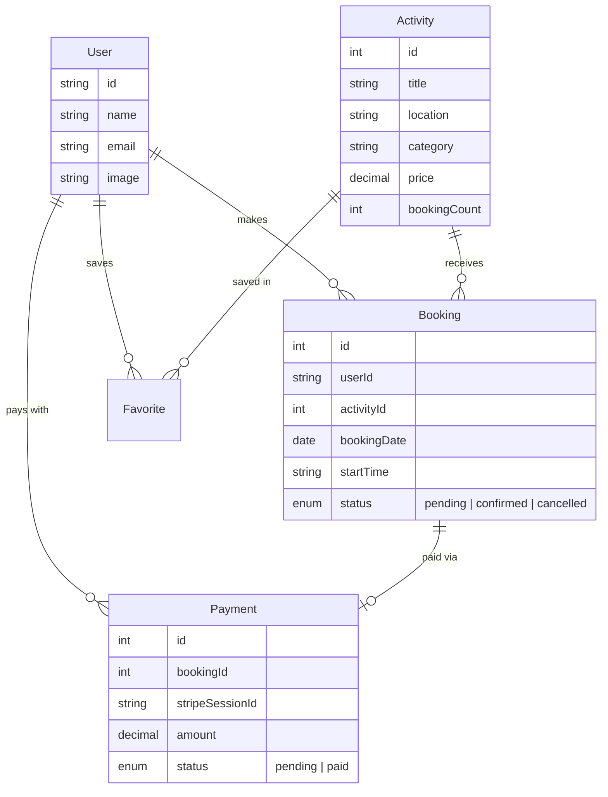
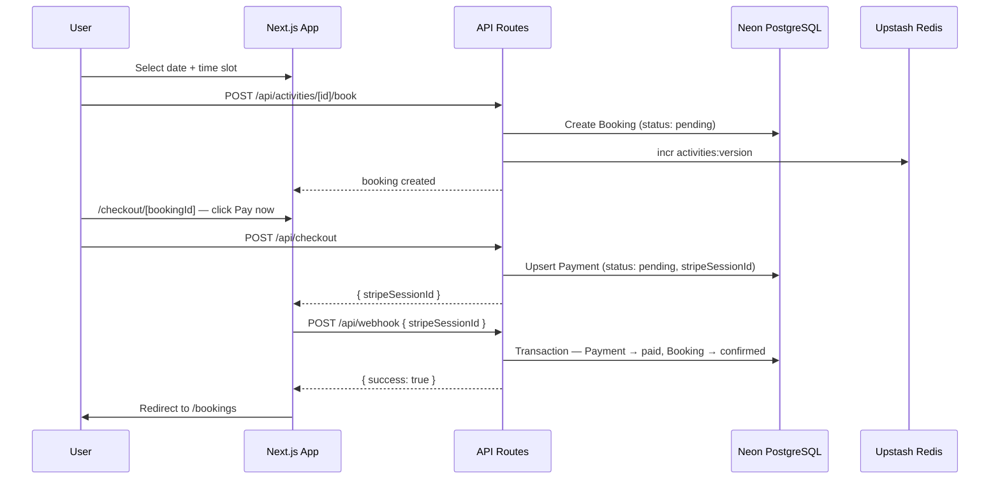
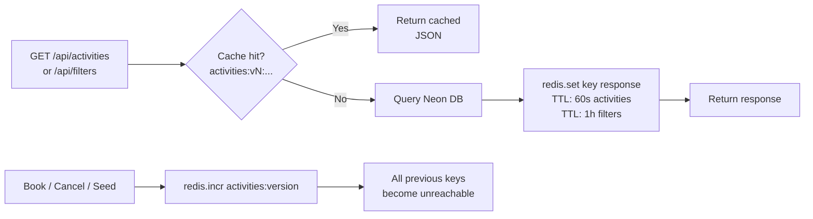

# Harbor — Activity Marketplace

A fullstack marketplace portfolio built with Next.js 16, Prisma, PostgreSQL, Redis, and Auth.js. Users can browse curated experiences, save favorites, book activities, and simulate a Stripe payment flow.

**Live demo:** [harbor on Vercel](https://marketplace-app-kappa-khaki.vercel.app)

---

## Tech stack

| Layer | Technology | Why |
|---|---|---|
| Framework | Next.js 16 (App Router) | Server Components, API Routes, file-based routing |
| Language | TypeScript | Type safety across the full stack |
| ORM | Prisma 6 | Type-safe DB queries, schema migrations |
| Database | Neon (PostgreSQL) | Serverless Postgres, free tier, instant branching |
| Cache | Upstash Redis | Serverless Redis, versioned cache keys |
| Auth | Auth.js v5 + GitHub OAuth | Session management, PrismaAdapter for DB persistence |
| Styling | Tailwind CSS 4 + custom CSS | Utility base + design tokens for a consistent UI |
| Map | Leaflet + React-Leaflet | Lightweight interactive map, no API key required |
| Testing | Jest + Playwright | Unit tests on pure logic, E2E on critical user paths |
| Deployment | Vercel | Native Next.js support, zero-config |

---

## Architecture



**Key architectural choices:**
- The activity detail page is a **Server Component** — it fetches Prisma directly without going through an API route, which reduces latency and avoids an unnecessary round-trip.
- API routes serve **Client Components** (home page, bookings, checkout) where interactivity requires client-side fetching.
- Redis caching uses a **versioned key strategy**: a `activities:version` counter is incremented on any write, making all previous cache keys instantly stale without requiring explicit deletion.

---

## Data model



---

## Booking and payment flow



**Note on the payment simulation:** in production this would use `stripe.webhooks.constructEvent()` to verify the request signature. The current implementation simulates the flow so the full UX can be demonstrated without real card credentials.

---

## Cache strategy



---

## Dev vs production

| | Development | Production |
|---|---|---|
| App server | `npm run dev` on `localhost:3000` | Vercel (auto-deploy from `main`) |
| Database | Neon — same instance | Neon — same instance |
| Redis | Upstash — same instance | Upstash — same instance |
| Auth callback | `http://localhost:3000` | Vercel deployment URL |
| Env variables | `.env.local` (gitignored) | Vercel Environment Variables |
| Build | Turbopack hot reload | `next build` (optimised, static where possible) |

> For a production app, dev and prod would use separate Neon branches and Upstash databases to avoid polluting production data during development.

---

## Running locally

**Prerequisites:** Node.js 20+, a Neon account, an Upstash account, a GitHub OAuth app.

```bash
# 1. Clone and install
git clone https://github.com/DavRengifo/marketplace-app.git
cd marketplace-app
npm install

# 2. Configure environment — copy and fill in your values
cp .env.example .env.local

# 3. Push the schema to your database
npx prisma db push

# 4. Seed activities
curl -X POST http://localhost:3000/api/activities \
  -H "x-admin-key: YOUR_ADMIN_SEED_KEY"

# 5. Start the dev server
npm run dev
```

**Required environment variables** (see `.env.example`):

| Variable | Source | `.env.local` | Vercel | GitHub Secrets |
|---|---|---|---|---|
| `DATABASE_URL` | Neon — Connection string | ✅ | ✅ | ✅ |
| `AUTH_SECRET` | Generate: `openssl rand -hex 32` | ✅ | ✅ | ✅ |
| `AUTH_URL` | — | `http://localhost:3000` | `https://your-app.vercel.app` | `http://localhost:3000` |
| `AUTH_GITHUB_ID` | GitHub OAuth App | ✅ | ✅ | ✅ |
| `AUTH_GITHUB_SECRET` | GitHub OAuth App | ✅ | ✅ | ✅ |
| `UPSTASH_REDIS_REST_URL` | Upstash — REST API tab | ✅ | ✅ | ✅ |
| `UPSTASH_REDIS_REST_TOKEN` | Upstash — REST API tab | ✅ | ✅ | ✅ |
| `ADMIN_SEED_KEY` | Generate: `openssl rand -hex 32` | ✅ | ✅ | ✅ |

> `AUTH_URL` is the only variable with a different value per environment.

---

## Testing

```bash
# Unit tests (Jest — pure utility functions)
npm test

# E2E tests (Playwright — requires dev server running)
npm run dev           # in one terminal
npx playwright test   # in another
```

**Unit tests** cover 5 pure functions in `lib/booking-utils.ts`: slot availability, past booking detection, cancellation deadline, and input validation — 36 tests total.

**E2E tests** cover the unauthenticated happy path: home page loads with activity cards, and the location filter correctly narrows results.

**CI:** GitHub Actions runs Jest on every push to `main`, then Playwright if Jest passes.

---

## Project structure

```
app/
  page.tsx                        # Home — activity grid, filters, map, favorites
  activity/[id]/page.tsx          # Activity detail — Server Component
  bookings/page.tsx               # My bookings — upcoming / past tabs
  checkout/[bookingId]/page.tsx   # Simulated payment page
  api/
    activities/                   # GET list (cached) + POST seed (admin-protected)
    activities/[id]/              # GET detail + POST book
    bookings/                     # GET list + DELETE cancel + PATCH modify
    checkout/                     # POST create payment session
    webhook/                      # POST confirm payment (atomic transaction)
    favorites/                    # GET / POST / DELETE
    filters/                      # GET distinct locations + categories (cached)
components/
  ActivityCard.tsx                # Card with favorite toggle
  ActivityDetailActions.tsx       # Booking panel (date, time slot, confirm)
  BookingCard.tsx                 # Booking card with modify / cancel actions
  FiltersBar.tsx                  # Category, location, sort selectors
  Header.tsx                      # Sticky nav with auth state
  Map.tsx                         # Leaflet map with activity markers
  Providers.tsx                   # SessionProvider wrapper
lib/
  booking-utils.ts                # Pure utility functions (unit tested)
  prisma.ts                       # Prisma singleton
  redis.ts                        # Upstash Redis client
__tests__/
  booking-utils.test.ts           # 36 Jest unit tests
e2e-tests/
  home.spec.ts                    # Playwright E2E tests
```
